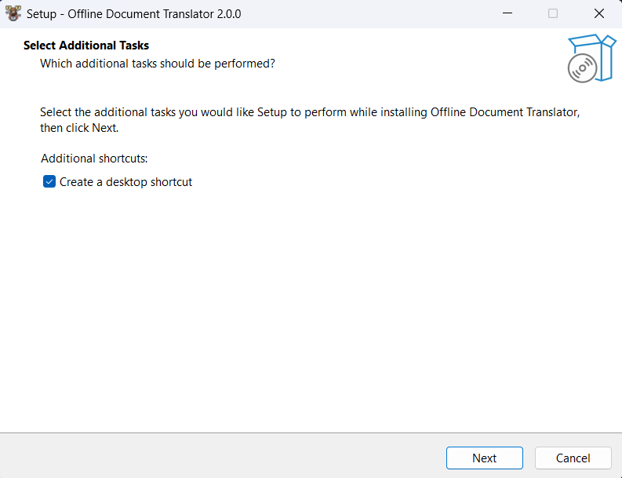
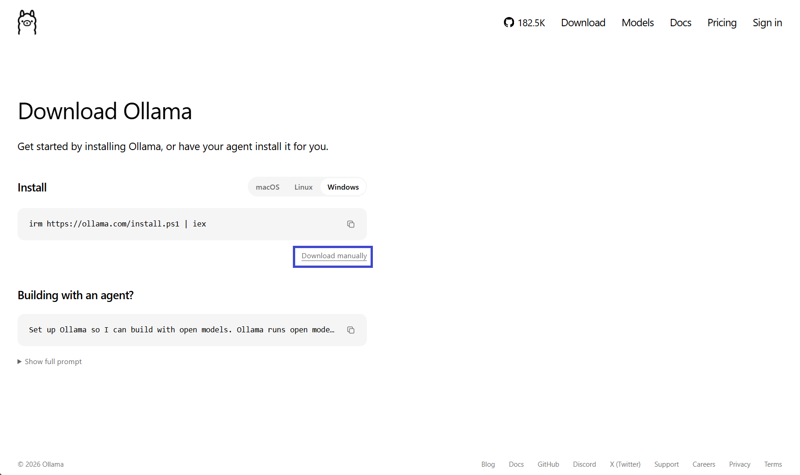
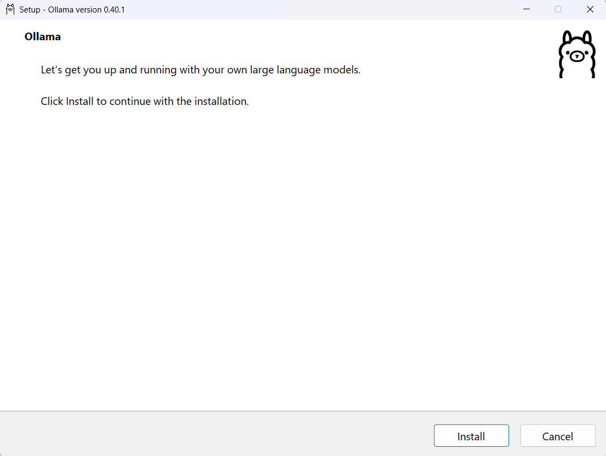
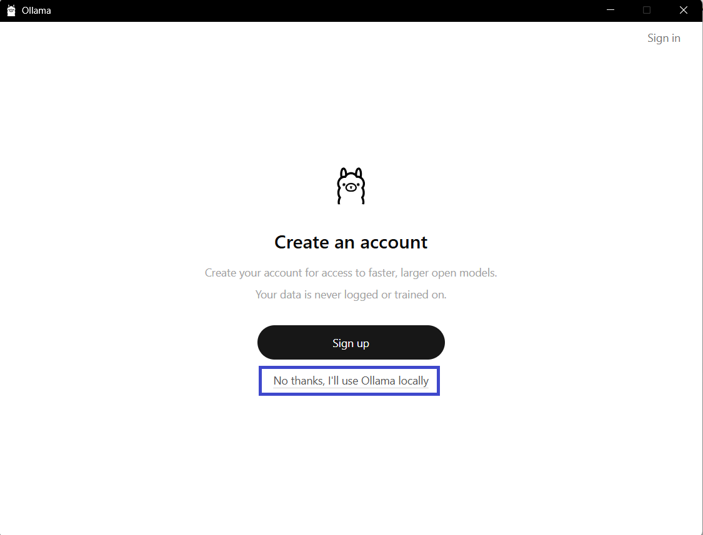
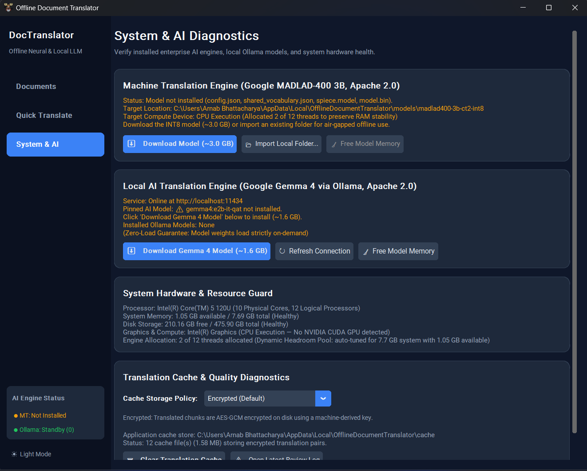
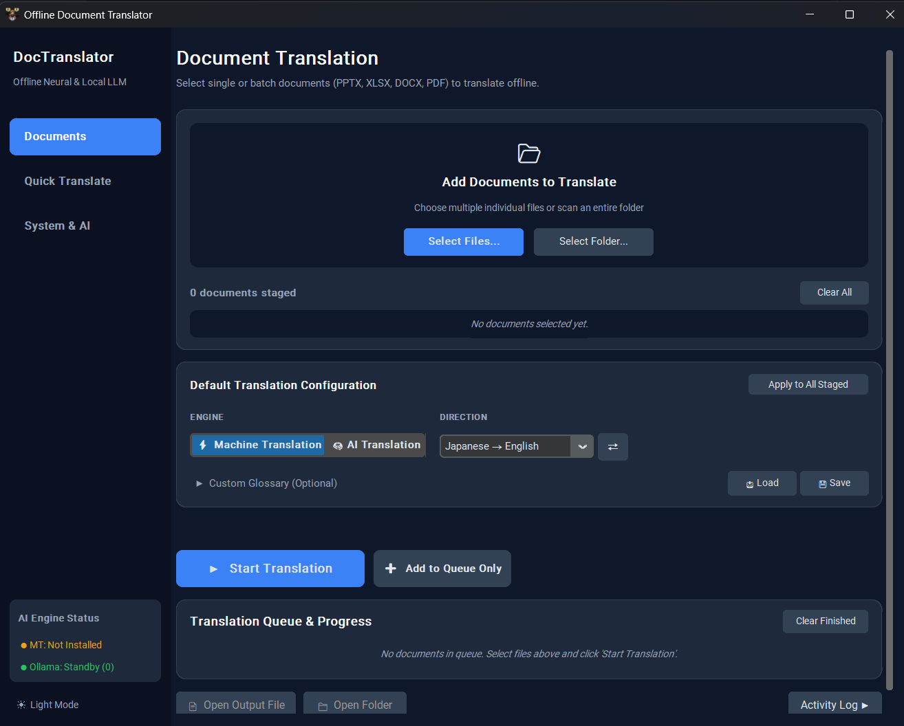
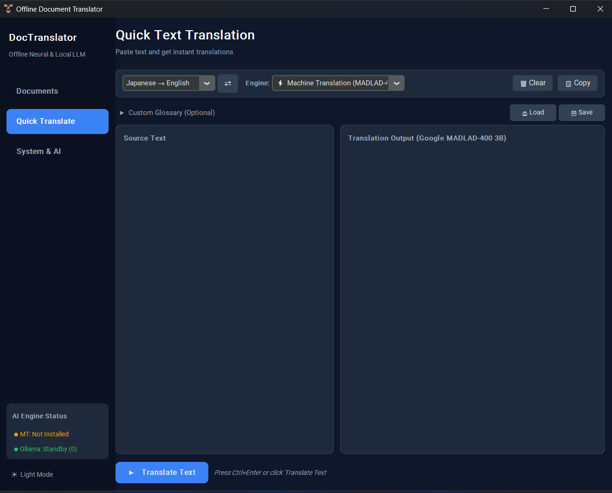

# Offline Document Translator

Translate Japanese ↔ English documents **100% privately on your own Windows computer**. No cloud APIs, no subscriptions, no internet required during translation, and complete privacy for confidential business and personal data.

---

> [!WARNING]
> ### ⚠️ PDF Translation Status (Under Active Development)
> PDF translation is currently under construction and **does not work yet**. 
> **Please do not attempt to translate PDF files at this time.** 
> 
> ✅ **Fully supported document formats:**
> - **Microsoft Word** (`.docx`) — Preserves fonts, bold/italic text, tables, and layouts.
> - **Microsoft PowerPoint** (`.pptx`) — Preserves slide layouts, text boxes, and shapes.
> - **Microsoft Excel** (`.xlsx`) — Preserves sheet structures, cell styles, and formulas.

---

## 📸 Step-by-Step Setup Guide

Follow this simple 4-step walkthrough to get completely set up in just a few minutes.

---

### Step 1: Install Offline Document Translator

1. Download **`OfflineTranslatorSetup.exe`** from the latest [GitHub Releases](https://github.com/arnab0bhattacharya/offline-doc-translator/releases).
2. Double-click the file to start the installation wizard.
   > **Note for Windows SmartScreen**: If Windows displays a blue popup saying *"Windows protected your PC"*, click **More info**, then click **Run anyway**.
3. Follow the on-screen setup prompts and click **Next** until finished.


*Follow the on-screen setup wizard to install the application.*

---

### Step 2: Install Ollama (Essential for AI Translation!) ⚠️

> [!IMPORTANT]
> **Do not skip this step!**  
> To use the **AI Translation** features, Windows needs a free local AI engine called **Ollama**.

#### 2A. Download Ollama
The app installer will automatically offer to launch the Ollama installation for you. If you need to install it manually:
- Open your browser and go to **[https://ollama.com/download](https://ollama.com/download)**.
- Click the **Download for Windows** button to download `OllamaSetup.exe`.


*Download Ollama for Windows from the official website.*

#### 2B. Run the Ollama Installer
- Double-click `OllamaSetup.exe` and click **Install**.
- The installer will unpack and prepare the local background service.


*Click Install to set up Ollama on your computer.*

#### 2C. Skip Sign-in — Select "No thanks, I'll use Ollama locally"
> [!TIP]
> **No account or sign-in is required!**  
> When the installation completes, Ollama may open a prompt asking you to sign in.  
> Click **"No thanks, I'll use Ollama locally"** (or skip sign-in).

- Ollama will now run quietly in your Windows taskbar tray (near the clock in the bottom-right corner of your screen).


*Select "No thanks, I'll use Ollama locally" to keep everything 100% offline without creating an account.*

---

### Step 3: First-Time Setup (Download Both Models)

When you open the app for the very first time, you need to download the two translation models onto your computer. **You only ever have to do this once!**

1. Launch **Offline Document Translator** from your desktop shortcut.
2. In the left-hand menu, click on the **System & AI** tab.
3. Download both models using the two buttons on this screen:
   - **Model 1 — Machine Translation (Fast)**:
     - Under the **Machine Translation (MADLAD-400 3B)** section, click **⬇ Download Model (~3.0 GB)**.
     - Wait for the progress bar to finish until it displays **✅ Model ready**.
   - **Model 2 — AI Translation (Smart AI)**:
     - Under the **AI Translation Engine (Ollama)** section, click **⬇ Download Gemma 4 Model (~1.6 GB)**.
     - Wait for the progress bar to finish until it displays **✅ Google Gemma 4 is ready**.


*Download both models in the System & AI tab until both engines show green checkmarks.*

> 💡 **Using an Air-Gapped / Completely Offline PC?**  
> If your computer has no internet access at all, you can download the model on another PC, put the folder on a USB drive, and click **📁 Import Local Folder** under Machine Translation.

---

### Step 4: Translating Your Documents

Once both models are downloaded and show green checkmarks, you are ready to translate:

1. Click **Documents** in the left sidebar menu.
2. **Add Files**: Drag and drop your `.docx`, `.pptx`, or `.xlsx` files into the box, or click **Browse Files**.
3. **Select Direction**: Choose **Japanese ➔ English** or **English ➔ Japanese**.
4. **Choose Translation Engine**:
   - **⚡ Machine Translation**: Ultra-fast; great for long reports, large data sheets, and batch files.
   - **🧠 AI Translation**: High-fidelity AI; great for conversational, marketing, and nuanced phrasing.
5. Click the green **▶ Start Translation** button.
6. When translation is finished, click **Open Output Folder** to view your translated files with all formatting, tables, and colors preserved!


*Drop your files, choose your language direction and engine, and click Start Translation.*

---

## ⚡ Additional Features

### 🔍 Quick Translate (Instant Lookup)
Need to translate a quick paragraph, email draft, or phrase without translating an entire document?
- Click **Quick Translate** in the left sidebar.
- Type or paste your text on the left and see the translation appear instantly on the right.


*Instant side-by-side text lookup with custom glossary injection.*

### 📖 Custom Glossaries
Need specific company names, technical terminology, or product names translated consistently?
- In the **Documents** tab, expand the **Custom Glossary** section.
- Add your exact word mappings (e.g. `株式会社 -> Corporation` or `納期 -> Delivery Date`).

---

## 🛠️ Frequently Asked Questions & Troubleshooting

#### 1. What if my model download gets interrupted or disconnects?
If your internet drops mid-download, simply return to the **System & AI** tab and click **↻ Repair / Re-download Model**. The app automatically checks file integrity, removes any partial downloads, and resumes cleanly.

#### 2. Does this app ever send my documents to the cloud or third parties?
**Never.** Both the machine translation engine and the AI engine run 100% locally on your computer's hardware. Your documents and translations never leave your machine.

#### 3. Can I run this without an expensive graphics card (GPU)?
**Yes.** The Machine Translation engine is optimized to run smoothly on any standard Windows CPU with 8 GB of RAM or more.

---

## 💻 For Developers / Running from Source

If you prefer to run from source code rather than using the installer:

```bash
# Clone the repository
git clone https://github.com/arnab0bhattacharya/offline-doc-translator.git
cd offline-doc-translator

# Install dependencies
pip install -r requirements.txt

# Launch the desktop app
python main.py
```
